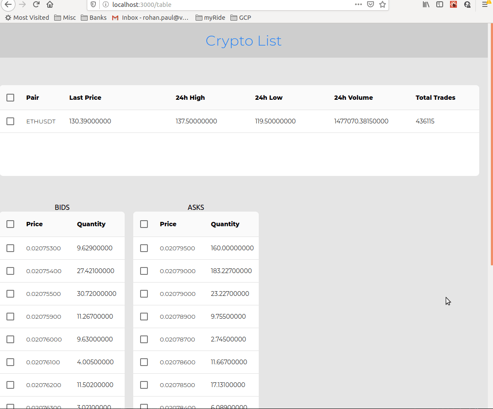

##### The LIVE site running [here](https://realtime-cryptocurrency-price.netlify.com/)

Its built with React, Redux and Material-UI.

#### To launch the project locally first git clone and then in the root directory

`yarn install` and then

`yarn start`

This will run the app in the development mode. 
Open [http://localhost:3000](http://localhost:3000) to view it in the browser.

#### To run the tests (there are around 12 passing tests)

`yarn test`
